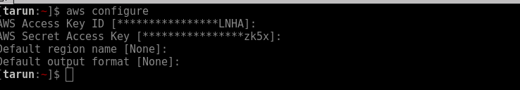

# aws-ec2-ebs-rotational-snapshot

Bash script for Automatic EBS Snapshots and Delete obsolete Backups.

**Todo this you need to install some dependencies on your system.**

- ```apt-get install jq```

- ```pip install awscli```

Now, Configure Aws command line utility
- ```aws configure```



- Enter aws Access key and Hit enter
- Now Enter Aws Secret Access Key and Hit Enter
- Enter Region name and hit enter
- For output format, remain blank and Hit Enter beacuse by default it uses JSON


**How to Use**

- To backup Ec2, run command 
``` ./ec2_backup_script.sh backup```

- To delete old Backup, run command below-
	to use **delete** command we need two arguments
	first is **delete** argument to tell script we need to delete snapshots and second is **x** (int value) to delete snapshots older than x days
	``` ./ec2_backup_script.sh delete 5 ```
	will delete all snapshots older than 5 days
	
**Setup Cron**
You can also setup this script as a cron for daily backup and delete obsolete backups which are older than a week.
